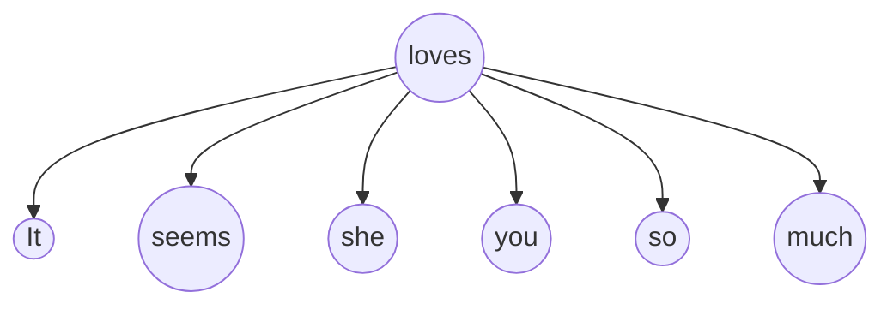
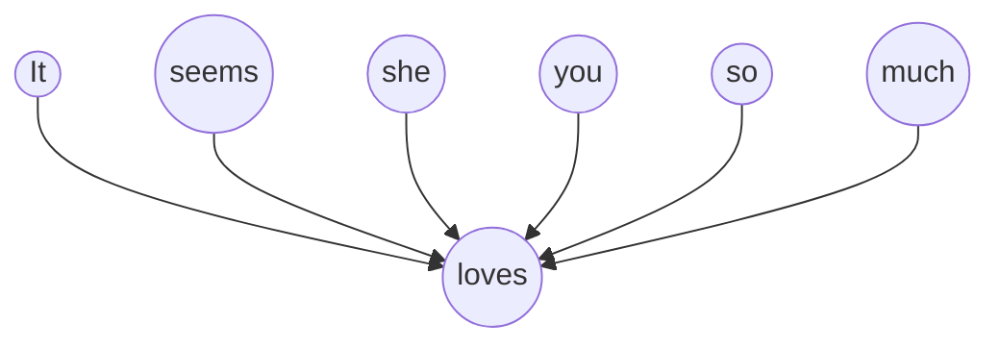

> Expressing and processing the nuance and wildness of language--while achieving the strong transfer of information that language is intended to achieve--makes representing words an endlessly fascinating problem. 

To better compute with words, we need to represent them as vectors. So we move to some methods. Remember our goal.

> [!abstract] Goal
> Learn rich representations of complex objects from data to get the word vectors

# Independent Word Vectors

**One-hot Vectors**: The simplest way to represent words is to use a vector of length $V$, where $V$ is the number of words in the vocabulary. Each word is represented by a vector of length $V$, where the $i-th$ element of the vector is 1 if the word is the $i-th$ word in the vocabulary, and 0 otherwise. 

For example, a vocabulary set ${\{..., tea, ..., coffee, ..., cat, ..., dog\}}$
will be represented as:

$$ 
v_{\text{tea}} = [0,0,1,\dots,0] \qquad v_{\text{coffee}} = [\dots,0,0,1,\dots] \tag{1}
$$
$$
v_{tea}^{\top}v_{coffee} = v_{coffee}^{\top}v_{tea} = 0 \tag{2}
$$

**Limitation**: Well, one-hot vector encoding is very simple to build, but it has a big problem--**sparsity**--every two words are orthogonal with *NO similarities* at all. But in fact there are many words that share the similar meaning or context. Then we go next step.

---
# Human-annotated Word Vectors 

There is grammatical information, like plurality, there’s derivational information, like how the runners is something like the verb to run plus a notion of “doer”, or agent (think one who runs.) There’s also semantic information, like
how runners might be a hyponym of humans, or animals, or entities. (A hyponym is a member of an is-a relationship; e.g., a runner is a human.)

1. **WordNet** [^wordnet]: it annotates for synonyms, hyponyms, and other semantic relations;
2. **UniMorph** [^unimorph]: it annotates for morphology (subword structure) information across many languages.

$$
v_{\text{tea}} = \left[ \begin{array}{c}0\\0\\1\\\vdots\\1\end{array}\right] \quad \begin{array}{l}\text{(plural noun)}\\\text{(3rd singular verb)}\\\text{(hyponym-of-beverage)}\\\vdots\\ \text{(synonym-of-chai)} \end{array}
\tag{3}
$$

**Limitation**
- Updating these resources is costly and they’re always incomplete.
- A very high-dimensional vector (much larger than the vocabulary size) to represent all of these categories.

---
# Distributional Vectors
> Take part of the data (maybe a word in a sentence) and attempt to predict other parts of the data (other words) with it. While simple, this is one of the most influential and successful ideas in all of modern NLP.

## Co-occurrence matrices

This is a document-level method. It is a matrix $X$ ($X_{tea} \in \mathbb{R}^{|\mathcal{V}|} $, a row in the matrix) where each row and column represents a word in the corpus. The cell (i, j) represents the number of times word i and word j appear together in a specific window size throughout the corpus.

$$
[It’s \ hot \ and \ delicious. [ \ I \ poured \ [the \underset{center \ word}{\underbrace{tea}} for ]_1 \ my \ uncle ]_3 ]_{document}
$$

**Feature**
- *Larger* notions of co-occurrence (e.g., large windows or documents) lead to more *semantic* or even topic - encoding representations; *shorter* windows lead to more *syntax* - encoding representations.
- It's a sparse representation based on statistics.

**Limitation**
- $\mathcal{V}$ - sized vectors are unweildy for large vocabularies (usually > 10k).
- Overemphesize of the very common words like: The, a, etc.

## Pointwise mutual information (PMI) matrix

PMI[^pmi] is the log of the ratio of the joint probability of a word pair to the product of the individual probabilities of each word.

For original PMI, when $PMI(w,c)=\log 0 = -\infin$, we set it to 0 in a common way. A more consistent way is to use the PPMI (positive PMI)[^ppmi]

$$
\begin{align}
    \text{PMI}(w,c)&=\ln\frac{p(w,c)}{p(w)p(c)}=\ln\frac{N(w,c)\cdot N}{N(w),N(c)}\\
    \text{PPMI}(w,c)&=\max(\text{PMI}(w,c),,0)
\end{align}\tag{4}
$$

**Limitation**:
- A rare word pair may have a high PMI, but it’s not a good representation of the word pair. 
- For example, A rare context $c$ that co-occurred with a target word $w$ even once, will often yield relatively high PMI score because $P(c)$

## Latent semantic analysis (LSA)[^lsa]

In traditional LSA, we use the co-occurrence matrix (originally, the row represents word and the colomn represents doc) to compute a lower dimension vector for word. But we can also use PMI matrix to do so.

## Word2Vec model[^word2vec]

Ok, rethink about the problem we are facing now and our goal of building word vector. We want it to be:

 1) Smaller (better in hundreds dimensions)  2) and Representing Ability (syntatic & semantic)

### **Skip-gram**

**Idea**

Predict the context words using the center word. $P( 'it','seems','she', 'you', 'so', 'much' | 'loves')$

- Given a corpus, build a low-dimensional vector representation for each word.
1. divide the corpus into sentences.
2. set a window size.
3. extract the center word and the context words around it within the window size. 
4. build two embedding matrices (**low dimension**), $V$ for center words and $U$ for context words.
5. **OUR GOAL: find the best $V$ and $U$ make the context words close to the center words** which is resonable semantically.
6. suppose that these words within a window size in a document should have something meaningful in common. So **the probability of the co-occurrence of these words shall be as high** as it could be. Then do some math ↓ .

> [!note] $V$? $U$?
> - Indeed, there will be two embedding matrices, so each word has two embedding vectors: one as center word and the other as context word. 
> - However, practically we only use center word embedding matrix $V$ or we use average of  $U$ and $V$.

**Algorithm**
> for some convenience, here $w_i = v_c$ as the center word and $w_{i+j} = u_o$ as the context words, equals that $P_{U,V}(u_o | v_c) = P_{U,V}(w_{i+j} | w_i)$; $k$ is the window size and $i-k$ is the start index of the window. $T$ is the length of the sentence $d$ and $d$ is one sentence in the corpus $D$.

1. Objective  is the probability of context word $u_o$ given center word $v_c$ as:
$$
P_{U,V}(u_o | v_c) = \frac{exp(u_o^{\top} v_c)}{\sum_{w\in \mathcal{V}} exp(u_w^{\top} v_c)}
\tag{4a}
$$

- Then we want to maximize the probability:
$$
\prod_{d\in D}\prod_{i=1}^T \prod_{j=-k, j\ne 0}^{k} P_{U,V}(w_{i+j} | w_i)
\tag{4b}
$$ 

2. Maximize $P_{U,V}(u_o | v_c)$, which is equivalent to minimize the negative log-likelihood, and for the whole corpus $D$, define the negative log-likelihood Loss:
$$
L(U, V) = - \sum_{d\in D}\sum_{i=1}^T \sum_{j=-k, j\ne 0}^{k} \log  P_{U,V}(w_{i+j} | w_i)
\tag{5}
$$

3. Work out the gradient of Loss with respect to $v_c$:

$$
\nabla _{v_c} L(U,V) = - \sum_{d\in D}\sum_{i=1}^T \sum_{j=-k, j\ne 0}^{k} \underset{focuse\ on\ this}{\underbrace{ \nabla _{v_c}  \log  P_{U,V}(w_{i+j} | w_i)}}
\tag{6}
$$

4. Propogate the gradient gradually (change $P_{U,V}(w_{i+j} | w_i) = P_{U,V}(u_o | v_c)$ back), and with Eqn4 we can get:

$$
\begin{align}
\nabla_{v_c}\log P_{U,V}(u_o \mid v_c)
&= \nabla_{v_c}\log \frac{\exp(u_o^{\top}v_c)}{\sum_{w\in \mathcal{V}} \exp(u_w^{\top}v_c)} \\
&= \underset{Part\ A}{\underbrace{\nabla_{v_c}\log \exp(u_o^{\top}v_c)}} - \underset{Part\ B}{\underbrace{\nabla_{v_c}\log \sum_{w\in \mathcal{V}} \exp(u_w^{\top}v_c)}} 
\end{align}
\tag{7}
$$

5. Part A: 
$$
\nabla_{v_c}\log \exp(u_o^{\top}v_c) = \nabla_{v_c} u_o^{\top}v_c = u_o
\tag{8a}
$$

6. Part B:
$$
\begin{align}
    \nabla_{v_c}\log \sum_{w\in \mathcal{V}} \exp(u_w^{\top}v_c) 
    &= \frac{1}{ \sum_{w\in \mathcal{V}} \exp(u_w^{\top}v_c)} \nabla_{v_c}\sum_{x\in \mathcal{V}} \exp(u_x^{\top}v_c) \\
    &= \frac{1}{ \sum_{w\in \mathcal{V}} \exp(u_w^{\top}v_c)} \sum_{x\in \mathcal{V}} \nabla_{v_c}\exp(u_x^{\top}v_c) \\
    &= \frac{1}{ \sum_{w\in \mathcal{V}} \exp(u_w^{\top}v_c)} \sum_{x\in \mathcal{V}} \exp(u_x^{\top}v_c) \nabla_{v_c}u_x^{\top}v_c \\
    &= \frac{1}{ \sum_{w\in \mathcal{V}} \exp(u_w^{\top}v_c)} \sum_{x\in \mathcal{V}} \exp(u_x^{\top}v_c) u_x \\
    &= \sum_{x\in \mathcal{V}} \underset{Eqn\ 4\ !}{\underbrace{\frac{\exp(u_x^{\top}v_c)}{ \sum_{w\in \mathcal{V}} \exp(u_w^{\top}v_c)}}} u_x \\
    &= \underset{Expectation}{\underbrace{\sum_{x\in \mathcal{V}} P_{U,V}(u_x | v_c) u_x}} \\
    &= \mathbb{E}[u_x]  \quad (x \in \mathcal{V})
\end{align}\tag{8b}
$$

$\quad$  > $w$ and $x$ both represent the each word in the vocabulary, counting independently in the same equation.

7. Put two parts together, we get the derivative of Loss with respect to $v_c$:

$$
\nabla _{v_c} L(U,V) = \sum_{d\in D}\sum_{i=1}^T \sum_{j=-k, j\ne 0}^{k} - (u_o - \mathbb{E}[u_w])    \quad (w \in \mathcal{V}) \tag{9}
$$

> [!check] Summary
> - Now that we've got a very simple model as shown in Eqn 1~9. 
> - However when we implement it on computers, it's not possible to go through all the words in the vocabulary for each center word to calculate $P_{U,V}(u_w | v_c) u_w$.
> -  Negative sampling is a method to address this problem.
> - Discussed in [Traing methods](#training-methods)

### **Continuous Bag-of-Words (CBOW)**

**Idea**

Predict the center word using the context words. $P('loves' | 'it','seems','she', 'you', 'so', 'much')$

**Algorithm**
CBOW is similar to Skip-gram, but predicting is inverse.

Similarly 
1. Objective:
$$
P_{U,V}(u_c | v_{o_1}, \dots ,v_{o_{2k}}) = \frac{exp(\frac{1}{2k}u_c^{\top} (v_{o_1}+, \dots, v_{o_{2k}}))}{\sum_{w\in \mathcal{V}} exp(\frac{1}{2k} u_w^{\top} (v_{o_1}+, \dots, v_{o_{2k}}))}
\tag{12}
$$

2. Suppose $\mathcal W_o = \{o_1, \dots, o_{2k}\}$ and $\bar v_o = \frac{1}{2k} (v_{o_1}+, \dots, v_{o_{2k}})$, then we can get the objective:
$$
P_{U,V}(u_c | \mathcal W_o) = \frac{exp(u_c^{\top} \bar v_o)}{\sum_{w\in \mathcal{V}} exp(u_w^{\top} \bar v_o)}
\tag{13}
$$

3. Negative log-likelihood Loss (take one element):
$$
\begin{align}
L(U, V) &= - \log  P_{U,V}(u_c | \mathcal W_o) \\
&= - (u_c^{\top} \bar v_o - \log \sum_{w\in \mathcal{V}} exp(u_w^{\top} \bar v_o))
\end{align}
\tag{14}
$$

4. Gradient:
$$
\begin{align}
    \nabla _{\bar v_o} L(U,V) &= - \frac{1}{2m} \left( u_c - \sum_{x\in \mathcal{V}} P_{U,V}(u_x | \mathcal W_o) u_x  \right) \\
    &= - \frac{1}{2m} \left( u_c - \mathbb{E}[u_w]  \right)
\end{align}
\tag{15}
$$

## Global Vectors (GloVe) [^glove]

### GloVe Idea
This is a great idea that combines both matrix factorization and shallow window-based methods. 

1. Notation: Let the matrix of word-word co-occurrence counts be denoted by $X$ , whose entries $X_{ij}$ tabulate the number of times word j occurs in the context of word i. Let $X_i = \sum_k X_{ik}$ be the number of times any word appears in the context of word i. Finally, let $P_{ij} = P(j|i) = X_{ij} / X_i$ be the probability that word j appear in the context of word i.
2. Co-occurrence probabilities: If we take three words like $i = ice$, $j = steam$ and $k=solid, gas$, then we expect the ratio $P_{ik}/P_{jk}$ to be some value bigger when k is close to i and smaller when k is close to j.

$$
\begin{align}
    \frac{P_{ik}}{P_{jk}} &= F(w_i, w_j, \tilde{w_k}) \\
    &= F((w_i -  w_j)^{\top}\tilde{w_k}) \\
    &= \frac{F(w_i^{\top}\tilde{w_k})}{F(w_j^{\top}\tilde{w_k})} \\
    &= \frac{P_{ik}/P_k}{P_{jk}/P_k}
\end{align}
\tag{16}
$$

Where F is $exp$. We can get the relations between word vectors and the co-occurrence counts ↓ Objective

$$
\begin{align}
    w_i^{\top}\tilde{w_k} &= \log(P_{ik}) \\
    &= \log(X_{ik}) - \log(X_i) \\
    &\rightarrow to\ erase\ log(X_i)\ and\ keep\ symmetry \\
    w_i^{\top}\tilde{w_k} + b_i + \tilde{b_k} &= \log{X_{ik}}
\end{align} 
\tag{17}
$$

For Eqn. 17, there is one drawback: it weighs the co-occurrence counts equally. But in fact we want give less weight to less common words and fixed weights to the most common words (like `the, a`).

3. Loss:

$$
J = \sum_{i,j=1}^{V}f(X_{ij})(w_i^{\top}\tilde{w_j} + b_i + \tilde{b_j} - \log X_{ij})^2 \tag{18} \\
f(x) = \begin{cases}(x/x_{max})^\alpha,\ if\ x < x_{max} \\ 1,\ otherwise \end{cases}
$$
Where $\alpha = 3/4 $ and $x_{max} = 100$

### Relations with Word2Vec

1. The Eqn.5 can be:
$$
J = - \sum_{ \\\begin{matrix} i \in corpus\\j \in context(i)\end{matrix} } \log{Q_{ij}} \tag{19}
$$

2. If we use the co-occrence matrix $X$, we can get:
$$
\begin{align}
    J &= - \sum_{i=1}^V \sum_{j=1}^V X_{ij} \log{Q_{ij}} \\
    &= - \sum_{i=1}^V X_i \sum_{j=1}^V P_{ij} \log{Q_{ij}} \\
    &= \sum_{i=1}^V X_i corross\_ entropy(P_i, Q_i)
\end{align}
\tag{20}
$$

3. While cross_entropy is not good to capture the distribution with long tails. Then introduce the least square loss:

$$
\begin{align}
   \hat{J} &= \sum_{i,j} X_i (\hat{P_{ij}} - \hat{Q_{ij}})^2 \\
   &= \sum_{i,j} X_i (w_i^{\top}\tilde{w_j} - \log X_{ij})^2 \\
   \hat{J} &= \sum_{i,j} f(X_{ij}) (w_i^{\top}\tilde{w_j} (+ b_i + \tilde{b_j}) - \log X_{ij})^2
\end{align}
\tag{21}
$$

---
# Training methods

1. Dynamic context window: The window size is dynamic and the weights of the context words are different. For example, a size-5 window will weigh its contexts by 5/5, 4/5, 3/5, 2/5, 1/5.
2. Subsampling: This is used to diluting very frequent words with a threshold of $t$. $p=1-\sqrt{\frac{t}{f}}$. 
3. Delete rare words.
4. Context distribution smoothing: In order to smooth the original contexts’ distribution, all context counts are raised to the power of $\alpha=0.75$
5. Number of negative samples: $N=5$
6. Add context vectors or not
7. Vector normalization: None, **Row**, Column, Both

## Negative Sampling [^neg]

Let's re-look at the probability of the context word $u_o$ given the center word $v_c$:
$$
P_{U,V}(u_o | v_c) = \frac{{\color{Green} exp(u_o^{\top} v_c)}}{{\color{Red} \sum_{w\in \mathcal{V}} exp(u_w^{\top} v_c)} }
\tag{22}
$$

1. Notice that:
- The so-called `probability` here is not the same with the statistical probability. We just borrow the concept and want $P_{U,V}(u_o | v_c)$ is as high as possible. There are two components:
- The $exp$ function ensure the value to be positive while the partition term is to make the sum of all the $exp$ values to be 1. The non-negative function can also be done by sigmoid $\sigma = \frac{1}{1+exp(-x)}$.
- ${\color{Green} exp(u_o^{\top} v_c)}$ encourages the model to make $u_o$ more like $v_c$; ${\color{Red} \sum_{w\in \mathcal{V}} exp(u_w^{\top} v_c)}$ encourages the model to make all the other $u_w$ for $w\ne o$ less like $v_c$. We could still use the window sized context words to encorage but only sample $k$ other words in the vocabulary to discourage instead.

2. Then the Objective  could be:
$$
P_{U,V}(u_o | v_c) = {\color{green}\sigma (u_o^{\top}v_c)}  {\color{red}\sum_{l=1}^k \sigma (-u_l^{\top}v_c)} \tag{23}
$$

3. Negative log-likelihood Loss (take one element):
$$
\begin{align}
L(U, V) &= - \log  P_{U,V}(u_o | v_c) \\
&= - \log \left( \sigma (u_o^{\top}v_c){\sum_{l=1}^k \sigma (-u_l^{\top}v_c)}\right) \\
&= - \log \sigma (u_o^{\top}v_c) - \log \sum_{l=1}^k \sigma (-u_l^{\top}v_c)
\end{align}\tag{24}
$$

# Code Examples

[Simple code for skip-gram & CBOW with negative sampling](https://github.com/viesuki/CS224N-Spring-2024-Assignments/tree/main/coding)

# References

[^wordnet]: [WordNet: a lexical database for English](https://dl.acm.org/doi/pdf/10.1145/219717.219748)
[^unimorph]: [UniMorph 4.0: Universal Morphology](https://aclanthology.org/2022.lrec-1.89.pdf)
[^pmi]: [Word association norms, mutual information, and lexicography](https://aclanthology.org/J90-1003.pdf)
[^ppmi]: [Extracting Semantic Representations from Word Co-occurrence Statistics: A Computational Study](https://research.birmingham.ac.uk/en/publications/extracting-semantic-representations-from-word-co-occurrence-stati)
[^lsa]: [Latent Semantic Analysis][(https://www.cs.cmu.edu/~lfarris/papers/lsa.pdf](https://www.academia.edu/14256198/Indexing_by_latent_semantic_analysis))
[^word2vec]: [Efficient Estimation of Word Representations in Vector Space](https://arxiv.org/pdf/1301.3781.pdf)
[^glove]: [GloVe: Global Vectors for Word Representation](https://nlp.stanford.edu/pubs/glove.pdf)
[^neg]: [Negative Sampling for Word Embeddings](https://arxiv.org/pdf/1310.4546.pdf)

