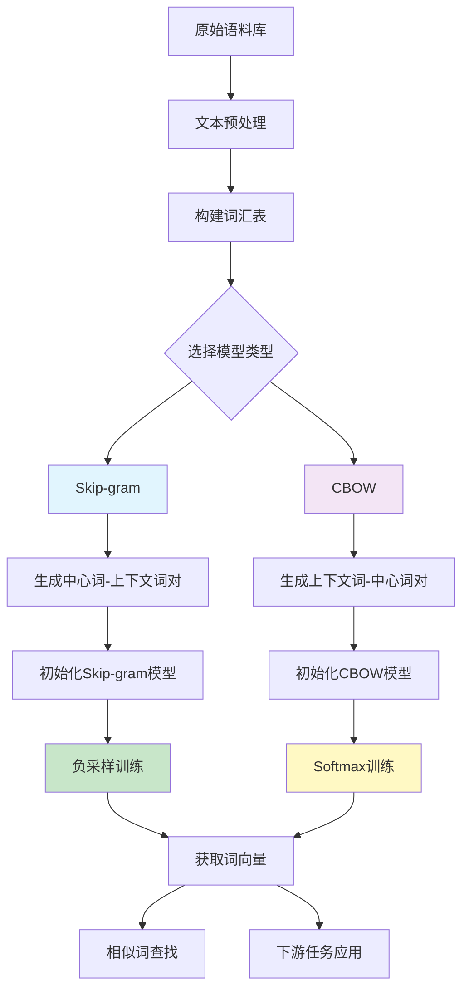

> Expressing and processing the nuance and wildness of language--while achieving the strong transfer of information that language is intended to achieve--makes representing words an endlessly fascinating problem. 

To better compute with words, we need to represent them as vectors. So we move to some methods. Remember our goal.

> [!abstract] Goal
> Learn rich representations of complex objects from data to get the word vectors

# Independent Word Vectors

**One-hot Vectors**: The simplest way to represent words is to use a vector of length $V$, where $V$ is the number of words in the vocabulary. Each word is represented by a vector of length $V$, where the $i-th$ element of the vector is 1 if the word is the $i-th$ word in the vocabulary, and 0 otherwise. 

For example, a vocabulary set ${\{..., tea, ..., coffee, ..., cat, ..., dog\}}$
will be represented as:

$$ 
v_{\text{tea}} = [0,0,1,\dots,0] \qquad v_{\text{coffee}} = [\dots,0,0,1,\dots] \tag{1}
$$
$$
v_{tea}^{\top}v_{coffee} = v_{coffee}^{\top}v_{tea} = 0 \tag{2}
$$

**Limitation**: Well, one-hot vector encoding is very simple to build, but it has a big problem--**sparsity**--every two words are orthogonal with *NO similarities* at all. But in fact there are many words that share the similar meaning or context. Then we go next step.

# Human-annotated Word Vectors 

There is grammatical information, like plurality, there’s derivational information, like how the runners is something like the verb to run plus a notion of “doer”, or agent (think one who runs.) There’s also semantic information, like
how runners might be a hyponym of humans, or animals, or entities. (A hyponym is a member of an is-a relationship; e.g., a runner is a human.)

1. **WordNet** [^wordnet]: it annotates for synonyms, hyponyms, and other semantic relations;
2. **UniMorph** [^unimorph]: it annotates for morphology (subword structure) information across many languages.

$$
v_{\text{tea}} = \left[ \begin{array}{c}0\\0\\1\\\vdots\\1\end{array}\right] \quad \begin{array}{l}\text{(plural noun)}\\\text{(3rd singular verb)}\\\text{(hyponym-of-beverage)}\\\vdots\\ \text{(synonym-of-chai)} \end{array}
\tag{3}
$$

**Limitation**
- Updating these resources is costly and they’re always incomplete.
- A very high-dimensional vector (much larger than the vocabulary size) to represent all of these categories.

# Distributional Methods
> Take part of the data (maybe a word in a sentence) and attempt to predict other parts of the data (other words) with it. While simple, this is one of the most influential and successful ideas in all of modern NLP.

## Co-occurrence matrices

[^wordnet]: [WordNet: a lexical database for English](https://dl.acm.org/doi/pdf/10.1145/219717.219748)
[^unimorph]: [UniMorph 4.0: Universal Morphology](https://aclanthology.org/2022.lrec-1.89.pdf)

