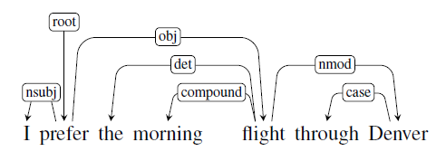
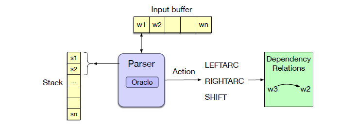
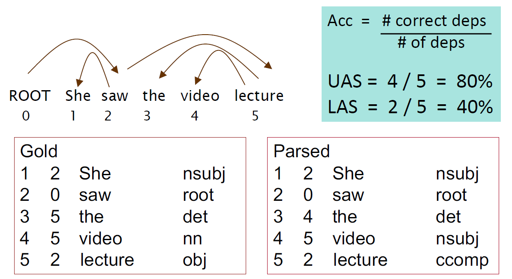

> [!info] 
> All the following materials are referred from *Speech and Language Processing*[^SLP3]-a very good NLP book from Stanford University, and *CS224N Lecture 4*[^CS224N]

# Basics

## Glossary

1. Dependency grammars: is one of the grammar formalisms families. The syntactic structure of a sentence is represented by a directed graph, where the nodes are the words of the sentence and the edges are the dependencies between them.
   
   

2. Root: the head of the entire sentence
3. Head & Dependent: Relations between words are illustrated by directed, labeled arcs. The arc is directed from the head to the dependent. The head plays the role of the central dependent organizing word, and the dependent as a kind of modifier.

## Dependency Relations

### Two advantages
1. The head-dependency structure is a good representation of the syntactic structure of a sentence and meanwhile a good proxy for the **semantic relations between predicates and their arguments**.
2. The dependency grammars can deal with a relatively **free word order** well.

### Grammatical relation

Linguists have developed taxonomies of relations that go well beyond the familiar notions of subject and object. 

> The Universal Dependencies (UD) project[^ud] is an open community effort to annotate dependencies and other aspects of grammar across more than 100 languages, provides an inventory of **37** dependency relations.

Basically, the grammatical relations are classified into two types:
1. **Clausal relations** that describe syntactic roles with respect to a predicate (often a verb).
2. **Modifier relations** that categorize the ways that words can modify their heads.
Consider the former example in this page, the clausal relations `NSUBJ` and `OBJ` identify the subject and object of the predicate *cancel*, While the `NMOD`, `DET`, and `CASE` relations denote modifiers of the nouns flights and Houston.

### Dependency formulism

- A dependency structure can be represented as a directed graph $G=(V;A)$, consisting of a set of vertices V, and a set of ordered pairs of vertices A, which we’ll call arcs. The set of arcs, A, captures the headdependent and grammatical function relationships between the elements in V.
- Among the more frequent restrictions are that the structures must be connected, have a designated root node, and be acyclic or planar. And a dependency tree is a directed graph.

> [!tip] Constraints for a dependency tree
> 1. There is a single designated root node that has no incoming arcs.
> 2. With the exception of the root node, each vertex has exactly one incoming arc.
> 3. There is a unique path from the root node to each vertex in V.

#### Projectivity
- An arc from a head to a dependent is said to be projective projective if there is a path from the head to every word that lies between the head and the dependent in the sentence. A dependency tree is then said to be projective if all the arcs that make it up are projective.
- **A dependency tree is projective if it can be drawn with no crossing edges**.

Two issues with Projectivity:
1. It will be **incorrect when non-projective** examples are encountered. Because the most widely used English dependency treebanks were automatically derived from phrasestructure treebanks generated in such a fashion which will always be projective.
2. There are **computational limitations** to the most widely used families of
**parsing algorithms**. Since the transition-based approaches can only produce projective trees, hence any sentences with non-projective structures will contain some errors.

The UD [Dependency Treebanks](https://universaldependencies.org/) is useful. Using UD, we can get the dependency tree and generate training data for parsing.

# Transition-Based Dependency Parsing

Transition-based parsing architecture draws on shift-reduce parsing, a paradigm originally developed for analyzing programming languages. In transition-based parsing we’ll have a stack on which we build the parse, a buffer of tokens to be parsed, and a parser which takes actions on the parse via a predictor called an oracle, as illustrated in the following figure.

1. **Stack**: is a list of words or tokens that have been shifted and are awaiting further processing.
2. **Buffer**: is a list of words or tokens that have not yet been shifted into the stack.
3. **Parser(oracle)**: is a predictor that takes a configuration and returns a transition operator.

## Arc standard [^arcstd]

- In arc standard parsing the transition operators only assert relations between elements at the top of the stack, and once an element has been assigned its head it is removed from the stack and is not available for further processing.
- This approach is a straightforward greedy algorithm—the oracle provides a single choice at each step and the parser proceeds with that choice.
- The arc standard approach is quite effective and is simple to implement.

**configuration**: is the current state of the parse which includes the stack, an input buffer of words or tokens, and a set of relations representing a dependency tree. 

**Parsing**: means making a sequence of transitions through the space of possible configurations.

> [!note] Transition Operators for Arc Standard
> 1. **Left-Arc**: Assert a head-dependent relation between the word at the top of the stack and the second word; remove the second word from the stack.
> 2. **Right-Arc**: Assert a head-dependent relation between the second word on the stack and the word at the top; remove the top word from the stack.
> 3. **Shift**: Remove the word from the front of the input buffer and push it onto the stack.

The process ends when all the words in the sentence have been consumed and the `ROOT` node is the only element remaining on the stack.

> [!note] Parsing Procedure for Arc Standard
> 1. Choose LEFTARC if it produces a correct head-dependent relation given the reference parse and the current configuration,
> 2. Otherwise, choose RIGHTARC if (1) it produces a correct head-dependent relation given the reference parse and (2) all of the dependents of the word at the top of the stack have already been assigned,
> 3. Otherwise, choose SHIFT.

> [!Attention]
> The restriction on selecting the RIGHTARC operator is needed to ensure that a word is not popped from the stack, and thus lost to further processing, before all its dependents have been assigned to it.

### Parsing Example
"Book the flight through Houston"

| Step | Stack | Word List | Predicted Action | Dependency Formed |
|------|-------|-----------|------------------|-------------------|
| 0 | [root] | [book, the, flight, through, houston] | SHIFT | - |
| 1 | [root, book] | [the, flight, through, houston] | SHIFT | - |
| 2 | [root, book, the] | [flight, through, houston] | SHIFT | - |
| 3 | [root, book, the, flight] | [through, houston] | LEFTARC | `flight` ← `the` (det) |
| 4 | [root, book, flight] | [through, houston] | SHIFT | - |
| 5 | [root, book, flight, through] | [houston] | SHIFT | - |
| 6 | [root, book, flight, through, houston] | [] | LEFTARC | `houston` ← `through` (case) |
| 7 | [root, book, flight, houston] | [] | RIGHTARC | `flight` → `houston` (nmod) |
| 8 | [root, book, flight] | [] | RIGHTARC | `book` → `flight` (obj) |
| 9 | [root, book] | [] | RIGHTARC | `root` → `book` (root) |
| 10 | [root] | [] | Done | - |

## Arc-Eager

In an arc-standard approach, dependents are removed from the stack as soon as they are assigned their heads. If `flight` had been assigned `book` as its head in Step 4, it would no longer be available to serve as the head of `Houston`. While this delay doesn’t cause any issues in this example, in general the longer a word has to wait to get assigned its head the more opportunities there are for something to go awry. The arc eager approach gets its name from its ability to assert rightward relations much sooner than in the arc standard approach.

> [!note] Transition Operators for Arc Eager
> 1. **LEFTARC**: Assert a head-dependent relation between the word at the front of the input buffer and the word at the top of the stack; pop the stack.
> 2. **RIGHTARC**: Assert a head-dependent relation between the word on the top of the stack and the word at the front of the input buffer; shift the word at the front of the input buffer to the stack.
> 3. **SHIFT**: Remove the word from the front of the input buffer and push it onto the stack.
> 4. **REDUCE**: Pop the stack.

> Take the same example sentence as before, arc eager approach can produce the same result dependency tree in a different way.

| Step | Stack | Word List | Action | Relation Added |
|------|-------|-----------|--------|----------------|
| 0 | [root] | [book, the, flight, through, houston] | RIGHTARC | `root → book` |
| 1 | [root, book] | [the, flight, through, houston] | SHIFT | - |
| 2 | [root, book, the] | [flight, through, houston] | LEFTARC | `flight ← the` (det) |
| 3 | [root, book] | [flight, through, houston] | RIGHTARC | `book → flight` (obj) |
| 4 | [root, book, flight] | [through, houston] | SHIFT | - |
| 5 | [root, book, flight, through] | [houston] | LEFTARC | `houston ← through` (case) |
| 6 | [root, book, flight] | [houston] | RIGHTARC | `flight → houston` (nmod) |
| 7 | [root, book, flight, houston] | [] | REDUCE | - |
| 8 | [root, book, flight] | [] | REDUCE | - |
| 9 | [root, book] | [] | REDUCE | - |
| 10 | [root] | [] | Done | - |

# Evaluation

> [!note] Evaluation Metrics
> 1. **Labeled Attachment Score (LAS)**: The proper assignment of a word to its head along with the correct dependency relation.
> 2. **Unlabeled Attachment Score (UAS)**: The correctness of the assigned head, ignoring the dependency relation.
> - Label Accuracy Score (LS): the percentage of tokens with correct labels, ignoring where the relations are coming from.

# 37 Dependency Relations from UD

| Label | Full Name | Definition | Example |
|-------|-----------|------------|---------|
| acl | adnominal clause | finite or non-finite clause modifying a nominal | (28) |
| advcl | adverbial clause | adverbial clause modifying a predicate or modifier word | (27) |
| advmod | adverbial modifier | adverb or adverbial phrase modifying a predicate or modifier word | (20a) |
| amod | adjectival modifier | adjectival modifier of a nominal | (12) |
| appos | appositional modifier | a nominal used to define, name, or describe the referent of a preceding nominal | (15) |
| aux | auxiliary | links a function word expressing tense, mood, aspect, voice, or evidentiality to a predicate | (16c) |
| case | case marking | links a case-marking element (preposition, postposition, or clitic) to a nominal | (9) |
| cc | coordinating conjunction | links a coordinating conjunction to the following conjunct | (23) |
| ccomp | clausal complement | clausal complement of a verb or adjective without an obligatorily controlled subject | (26b) |
| clf | classifier | (numeral) classifier; a word reflecting a conceptual classification of nouns linked to a numeric modifier or determiner | (11) |
| compound | compound | any kind of word-level compounding (noun compound, serial verb, phrasal verb) | (37) |
| conj | conjunct | links two elements which are conjoined | (23) |
| cop | copula | links a function word used to connect a subject and a nonverbal predicate to the nonverbal predicate | (17a) |
| csubj | clausal subject | clausal syntactic subject of a predicate | (25) |
| dep | unspecified dependency | unspecified dependency, used when a more precise relation cannot be determined | - |
| det | determiner | determiner (article, demonstrative, etc.) in a nominal | (10) |
| discourse | discourse element | discourse element (interjection, filler, or non-adverbial discourse marker) | (20b) |
| dislocated | dislocated element | a peripheral (initial or final) nominal in a clause that does not fill a regular role of the predicate but has roles such as topic or afterthought | (22b) |
| expl | expletive | links a pronominal form in a core argument position but not assigned any semantic role to a predicate | (22c) |
| fixed | fixed multiword expression | links elements of grammaticalized expressions that behave as function words or short adverbials | (39) |
| flat | flat multiword expression | links elements of headless semi-fixed multiword expressions like names | (40) |
| goeswith | goes with | links parts of a word that are separated but should go together according to standard orthography or linguistic wordhood | (44) |
| iobj | indirect object | indirect object; nominal core argument of a verb that is not its subject or (direct) object | (16c) |
| list | list | links elements of comparable items interpreted as a list | (46) |
| mark | marker | links a function word marking a clause as subordinate to the predicate of the clause | (27a) |
| nmod | nominal modifier | nominal modifier; a nominal modifying another nominal | (13) |
| nummod | numeric modifier | numeric modifier; numeral in a nominal | (10) |
| nsubj | nominal subject | nominal subject; nominal core argument which is the syntactic subject (or pivot) of a predicate | (16) |
| obj | object | object; the core argument nominal which is the most basic core argument that is not the subject, typically the most directly affected participant | (16) |
| obl | oblique | oblique; a nominal functioning as a non-core (oblique) modifier of a predicate | (21) |
| orphan | orphan | links orphaned dependents of an elided predicate | (43) |
| parataxis | parataxis | links constituents placed side by side with no explicit coordination or subordination | (32) |
| punct | punctuation | punctuation attached to the head of its clause or phrase | (23b) |
| reparandum | reparandum | repair of a (normally spoken language) disfluency | (45) |
| root | root | root of the sentence | (16) |
| vocative | vocative | nominal directed to an addressee | (22a) |
| xcomp | clausal complement with controlled subject | clausal complement of a verb or adjective with an obligatorily controlled subject | (26a) |

# References

[^SLP3]: [Speech and Language Processing: version 3](https://web.stanford.edu/~jurafsky/slp3/ed3book_aug25.pdf)
[^CS224N]: [CS224N Lecture 4](https://web.stanford.edu/class/archive/cs/cs224n/cs224n.1246/)
[^ud]: [Universal Dependencies](https://watermark02.silverchair.com/coli_a_00402.pdf?token=AQECAHi208BE49Ooan9kkhW_Ercy7Dm3ZL_9Cf3qfKAc485ysgAAAzowggM2BgkqhkiG9w0BBwagggMnMIIDIwIBADCCAxwGCSqGSIb3DQEHATAeBglghkgBZQMEAS4wEQQMi3GDpJQXDxXG9nxrAgEQgIIC7QAWlD5Yv4IgcwSnoJXASXBmG8pE69aXvX0ON_dt_Vg5dRrvRztoIaLmdR_4EMdGIAuVtmZO8iVWtn2o159WL-IcoTJDPKzqIEvliaBmEgJFPQngH3GhjIB4UrEB897uH94YCqg8N7o5V0MPivrqxUUgCzdSbugrm7KsBWL1tABQzo2_hGt2uQus7kbz_H1y9qVNUGIgdZ4wMLx3G1_wdUOK8xlue-aVKSf3_JpacmC04H1YbIJx2uCnemuMGzd30B0L5ptVLUmKU-9VwHAvr_ViVC7EyU7Cx8W_5rGschh4OfdVO_VWI3dRHM87vzPAMKvQeOxqVWs_wW-1Fio0q8NBChbQYsUtAqOzhKigIqELZJjhTgpwWnVCxAP1Go58BKieJCeLjQrMxrE7rwbcwLoIeaz0ejLOmU2J3gW9bCkbfYQz3Xp9Xra2BDVDJHLH7YGmL7y3p09-xSnimc7PWozvvGhJO-T8HJJ1nIdqg3R3maWM64lv2Tt6IhOV7uectc2S6CFnTYnx2WXLwLWXAAl_MLk0t1UZ24m_MuRzf5HqN6FZ077QoXQkNDzdL75I3DD7r-US63DeZMAyovPWpE1B2r0UWXeB_JamO-PfOrtKsDiVvFdMVT4Z9eS_aXk40eGhOvi1jQv0NmtGLVckMbvUJZCKE5z-vEzFi-ONKdG9zy9aNMIng1TYD4luvanLWw-6EuNxwwHV5pASLeOGlCLyArDnI4_8TqZdjHUePqZFY14Slwpw-XZqmp1ZVbFO4PXI9kvn0FsxhHg79JIQFY5PCT-KW3HfzH84Q9qxavzYfffK2TUs_24wpXE3O_hkwpnLh_p-EYinJ5C6bv_f9gRdA2PvAPno35oS4OA49sDvtu0XhuePuGj48ExfcnLwZFUKL75ld_uDzE2v2nUMG5ZlLL1L1i7RuIm-IHVMld7r3O5gjyM4ZnlFePK-1j9Uj4Ri2gbqi2FUppfFZoyfzmgrQOVvAfqIqehoj_TD)
[^arcstd]: [Arc standard approach](https://ai1.ai.uga.edu/mc/dparser/dgpacmnew.pdf)