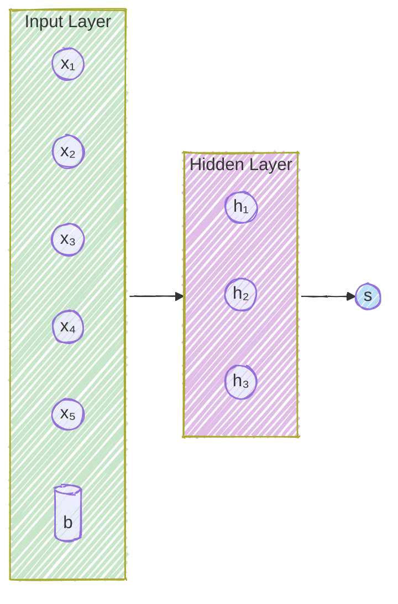
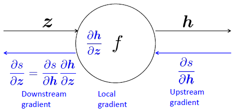

> [!info]
> - Acctually, there is not so much math that we need to do. However it's gonna make it easier to understand if we understand how to calculate the basic things i.e. derivatives / gradients.
> - The reason that modern nueral network is powerful is that it utilizes matrix caluculation with python(enven though python is not so efficient in some way). So here we do some matrix calculus.

# Simple NN

- input layer --> hidden layer --> output layer
- $\sigma$ is the activation function, which is usually ReLU or sigmoid.

$$
\begin{align}
    \mathbf{x} &= [x_1, x_2, ..., x_n]^T \\
    &\ \mathbf{z} = {\color{red}{\mathbf{W}}} \mathbf{x} + {\color{red}{\mathbf{b}}} \\
    \mathbf{h} &= \sigma(\mathbf{z}) \\
    s &= {\color{red}{\mathbf{u^T}}} \mathbf{h}
\end{align} \tag{1}
$$

> [!Note]
> - So for this simple neural network, we can use the above formula to calculate the output $s$. The input layer is the input vector $\mathbf{x}$, the hidden layer is the hidden vector $\mathbf{h}$, and the output layer is the output scalar $s$.
> - And thoughout the network, we need to calculate the gradient of the loss function with respect to each parameter, which is $\color{red}{\frac{\partial L}{\partial W}, \frac{\partial L}{\partial b}, \frac{\partial L}{\partial u}}$. For simplicity, we can just use $s$ to represent the gradient of the loss function with respect to each parameter.

# Tools

1. Jacobian Matrix

$$
\frac{\partial \mathbf{f}}{\partial \mathbf{x}} = \begin{bmatrix}
  \frac{f_1}{x_1} & \cdots & \frac{f_1}{x_n}\\
  \vdots & \ddots & \vdots\\
  \frac{f_m}{x_1} & \cdots & \frac{f_m}{x_n}
\end{bmatrix}\tag{2}
$$

2. Chain Rule

$$
\frac{\partial f}{\partial x} = \frac{\partial f}{\partial y} \frac{\partial y}{\partial x} \tag{3}
$$

# Calculation

Going back to [[#Simple NN]] and using [[#Tools]], we have:

1. What is $\frac{\partial \mathbf{h}}{\partial \mathbf{z}}$? Because $\sigma(\mathbf{z})$ is element-wise, which means $h_i = \sigma(z_i)$

$$
\begin{align}
    \left( \frac{\partial \mathbf{h}}{\partial \mathbf{z}} \right)_{i,j} &= \frac{\partial h_i}{\partial z_j} = \frac{\partial \sigma(z_i)}{\partial z_j} \\
    &=  \left\{\begin{matrix}
            \sigma^{'}(z_i) & \text{ if i=j}\\
            0 & \text{ if otherwise}
        \end{matrix}\right.    
\end{align}\tag{4}
$$

$$
\frac{\partial \mathbf{h}}{\partial \mathbf{z}} = \begin{bmatrix}
        \sigma^{'}(z_1) & \cdots & 0\\
        \vdots & \ddots & \vdots\\
        0 & \cdots & \sigma^{'}(z_n)
   \end{bmatrix} = diag(\sigma^{'}(\mathbf{z}))
   \tag{5}
$$

2. Other Jacobians
$$
\begin{align}
    &\frac{\partial}{\partial \mathbf{x}}(\mathbf{Wx+b}) = \mathbf{W}\\
    &\frac{\partial}{\partial \mathbf{W}}(\mathbf{Wx+b}) = \mathbf{x^T}\\
    &\frac{\partial}{\partial \mathbf{b}}(\mathbf{Wx+b}) = \mathbf{I}\\
    &\frac{\partial}{\partial \mathbf{u}}(\mathbf{u^T h}) = \mathbf{h^T}
\end{align}\tag{6}
$$

For example:

1. What is $\frac{\partial s}{\partial \mathbf{b}}$?
$$
\begin{align}
    \frac{\partial s}{\partial \mathbf{b}} &= \frac{\partial s}{\partial \mathbf{h}}\frac{\partial \mathbf{h}}{\partial \mathbf{z}} \frac{\partial \mathbf{z}}{\partial \mathbf{b}}\\
    &= \mathbf{u^T} diag(\sigma^{'}(\mathbf{z})) \mathbf{I}\\
    &= \mathbf{u^T} \odot \sigma^{'}(\mathbf{z})\\
    &= \mathbf{\delta}
\end{align}\tag{7}
$$

2. What is $\frac{\partial s}{\partial \mathbf{W}}$?
$$ 
\begin{align}
    \frac{\partial s}{\partial \mathbf{W}} &= \underset{\text{same as before}}{\underbrace{\frac{\partial s}{\partial \mathbf{h}}\frac{\partial \mathbf{h}}{\partial \mathbf{z}}}} \frac{\partial \mathbf{z}}{\partial \mathbf{W}} \\
    &= \mathbf{u^T} diag(\sigma^{'}(\mathbf{z})) \mathbf{x^T}\\
    &= \mathbf{\delta}^T \mathbf{x^T} \in \mathbb{R}^{m \times n}
\end{align}\tag{8}  
$$

> [!Note] Shape of derivatives
> - **Jacobian Form**: the result should be a ***row*** vector. For easy calculation of chain rule.
> - **Shape Convention**: the result should be a ***column*** vector. For easy SGD when training.
> 1. Use Jacobian form as much as possible, reshape to follow the shape convention at the end.
> 2. Always follow the shape convention.

# Backpropagation

Backpropagation is almost the most important part of DL. There are two steps:
1. Using upstream derivatives and local derivatives to calculate downstream derivatives.
2. Re-using these derivatives to update the parameters.
- Calculate all gradients at once just like using $\sigma$

How to calculate the gradients in NN frame?
1. Forwardprogate and record the intermediate values
2. Backpropagate and calculate the gradients
   - Load basic explicit formula for each step's gradient
   - Calculate the upsteam gradient
   - Then calculate the local gradient
   - Calculate the downsteam gradient

# Reference
[CS224N Lecture 3 PPT](https://web.stanford.edu/class/archive/cs/cs224n/cs224n.1246/slides/cs224n-spr2024-lecture03-neuralnets.pdf)

