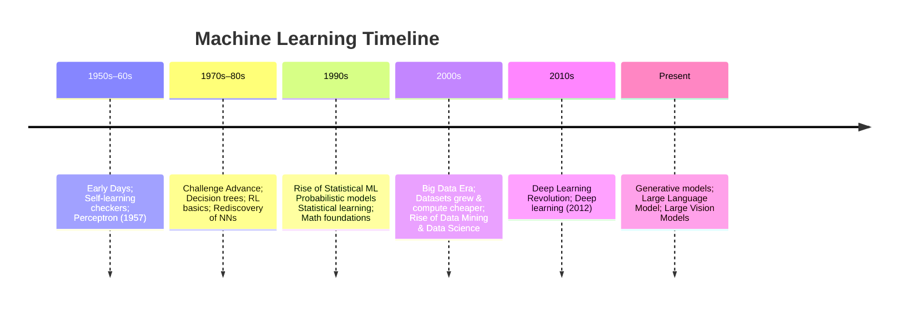
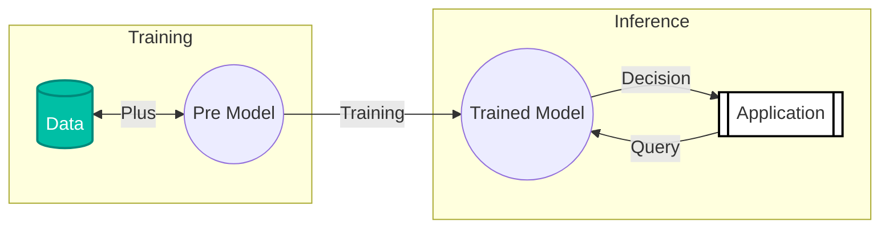
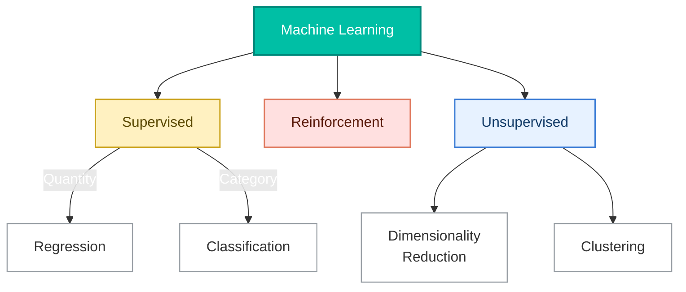
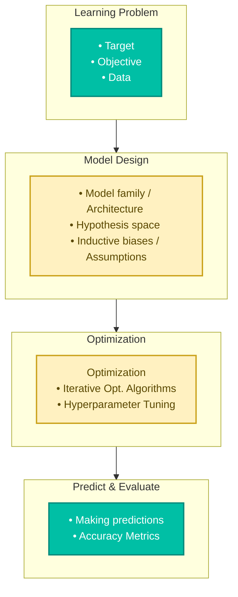

# History

```mermaid
timeline
    title Machine Learning Timeline
    1950s–60s : Early Days; Self-learning checkers; Perceptron (1957)
    1970s–80s : Challenge Advance; Decision trees; RL basics; Rediscovery of NNs
    1990s     : Rise of Statistical ML <br> Probabilistic models <br> Statistical learning; Math foundations
    2000s     : Big Data Era; Datasets grew & compute cheaper; Rise of Data Mining & Data Science
    2010s     : Deep Learning Revolution; Deep learning (2012)
    Present   : Generative models; Large Language Model; Large Vision Models
```

# Idea

```mermaid
flowchart LR
    subgraph Train[Training]
        D[(Data)]
        M((Pre Model))
    end

    subgraph Infer[Inference]
        N((Trained Model))
        A[[Application]]
    end

    D <-- Plus --> M
    M -- Training --> N
    A -- Query --> N
    N -- Decision --> A

    %% Styles (class names different from node ids)
    classDef dataNode fill:#00bfa5,color:#ffffff,stroke:#00897b,stroke-width:2px;
    classDef appNode  fill:#ffffff,stroke:#000000,stroke-width:2px;

    class D dataNode;
    class A appNode;
```

# Taxonomy

```mermaid
flowchart TB
    A["Machine Learning"]

    A --> B["Supervised"]
    A --> C["Reinforcement"]
    A --> D["Unsupervised"]

    B --Quantity--> E["Regression"]
    B --Category--> F["Classification"]
    D --> G["Dimensionality <br> Reduction"]
    D --> H["Clustering"]

    classDef root fill:#00bfa5,color:#ffffff,stroke:#00897b,stroke-width:2px;
    classDef sup  fill:#fff1c1,color:#5a4800,stroke:#caa21b,stroke-width:1.5px;
     classDef rl   fill:#ffe0e0,color:#5a1a0a,stroke:#e07a5f,stroke-width:1.5px;
     classDef uns  fill:#e7f2ff,color:#113a67,stroke:#3a7bd5,stroke-width:1.5px;
      classDef leaf fill:#ffffff,color:#333333,stroke:#9aa0a6,stroke-width:1.2px;

    class A root; class B sup; class C rl; class D uns;
    class E leaf; class F leaf; class G leaf; class H leaf;
```

# Cycle

```mermaid
flowchart TB
    subgraph A[Learning Problem]
        L[• Target <br>• Objective <br>• Data]
    end
    
    subgraph B[Model Design]
        M[• Model family / Architecture <br>• Hypothesis space <br>• Inductive biases / Assumptions]
    end

    subgraph C[Optimization]
        O[Optimization <br>• Iterative Opt. Algorithms <br>• Hyperparameter Tuning]
    end

    subgraph D[Predict & Evaluate]
        P[• Making predictions <br>• Accuracy Metrics]
    end

    A --> B --> C --> D

    classDef blue fill:#00bfa5,color:#ffffff,stroke:#00897b,stroke-width:2px;
    classDef gold fill:#fff1c1,color:#5a4800,stroke:#caa21b,stroke-width:2px;
    class L,P blue;
    class M,O gold;
```

# References
[1]: [UCB CS189 Lecture 1](https://eecs189.org/fa25)
