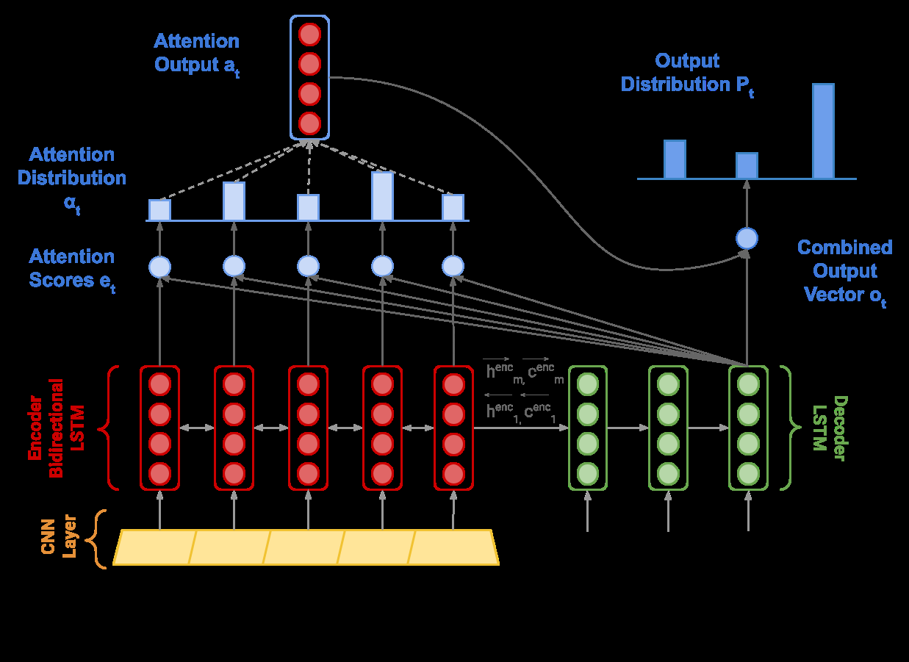

# Content

In Assignment 2, we will build a neural machine translation model using RNN and attention. Then we will do some analysis of NMT systems.

## Model constructure

> [!Note]
> 1. 

# Code

[Assign 3 Completion](https://github.com/viesuki/CS224N-Spring-2024-Assignments/tree/main/assign3)