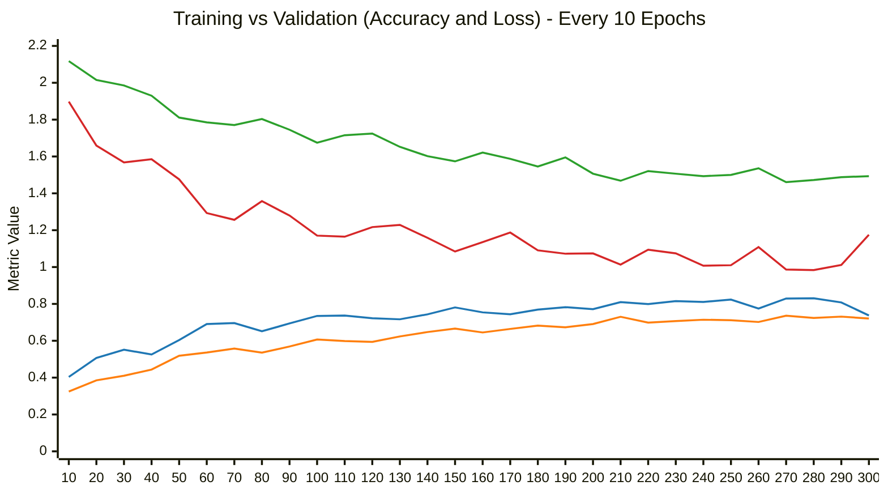

# Grading

> [!info] 
> 1. Simple: 0.50099
> 2. Medium: 0.73207
> 3. strong: 0.81872
> 4. Boss: 0.88446


# Solution
> Because of the time costed by each run, from this homework, I'll just try to make the best modelling method to get best score. And also for bossline, I won't pursue too much.


## results figure

***Myresidual***




## model results
epoch = 300
| Model  | HyperParameters <br> | Train <br> acc | Valid <br> acc | Public <br> Score | Private <br> Score |
| ---   | ---  | --- | --- | --- | --- |
| Sample code [^3]| ...| ... |... | 0.55278 | 0.57063 |
| MyResidual | derived from sample code <br> cnn_layer7 & 3 fc_layers <br> fc_dropout=0.5  | 0.72374 | 0.83288 | 0.85059 | 0.85872 |
| ResNet34 | 3 fc_layers, fc_dropout=0.5 |...| ... | 0.86553 | 0.85360 |
|    ↓     | ↓ Test Time Augmentation(TTM) <br> Average [5,1,1,1,1,1] |...|... | 0.87250 | 0.86641 |
| ↓ | ↓ Voting [2,1,1,1,1,1] | ... | ... | **0.87649** | **0.86641** | 
| ↓ + 50 more epoches | ↓ | ... | ... | ***0.88346*** | ***0.87195*** |

## techniques
1. Data augmentation [^1]
   ```python
   # implement ImageNet pre-trained mean & std.
   normalize = transforms.Normalize(mean=[0.485, 0.456, 0.406],
                                    std=[0.229, 0.224, 0.225])  

   test_tfm = transforms.Compose([
       transforms.Resize((128, 128)),
       transforms.PILToTensor(),
       transforms.ConvertImageDtype(torch.float),
       normalize,
   ])  # test tranforms, don't change basically.

   train_tfm = transforms.Compose([
       # Resize and crop the image into a fixed shape (height = width = 128)
       transforms.RandomResizedCrop((128, 128), scale=(0.8, 1.0), ratio=(1.0, 1.0)),
       transforms.RandomHorizontalFlip(),  # Horizontal flip
       transforms.RandomRotation(10),  # Rotate. Small rotation is enough
       transforms.RandomChoice([
           transforms.TrivialAugmentWide(),
           transforms.RandAugment(),
       ]),  # Use TrivialAugmentWide or RandAugment
       # ToTensor() should be the last one of the transforms.
       transforms.PILToTensor(),
       transforms.ConvertImageDtype(torch.float),
       normalize,
   ])
   ```
2. MixUp & CutMix [^1] [^2]
   ```python
   # 1. import .v2 to use MixUp & CutMix
   import torchvision.transforms.v2 as transforms
   from torch.utils.data import default_collate
   # .
   num_classes, alpha = 11, 1.0
   # 2. setting these two using torchvision.transforms.v2
   mixup = transforms.MixUp(num_classes=num_classes, alpha=alpha)
   cutmix = transforms.CutMix(num_classes=num_classes, alpha=alpha)
   # for each batch, choose one of Mixup or Cutmix 
   MorC = transforms.RandomChoice([mixup, cutmix], p=(0.5, 0.5))
   collate_fn = lambda batch: MorC(*default_collate(batch))
   # .
   # 3. implement when train_data loading
   train_loader = DataLoader(train_set, batch_size=batch_size, shuffle=True, 
                             num_workers=0, pin_memory=True,
                             drop_last=True, collate_fn=collate_fn)

    # .
    # 4. revise the acc calculation for Mixup & Cutmix
    acc = (logits.argmax(dim=-1) == labels.to(device).argmax(dim=-1)).float().mean()
   ```

3. Residual34 Model
   ```python
   class Resnet34(nn.Module):
       def __init__(self):
           super(Resnet34, self).__init__()
           self.resnet = torchvision.models.resnet34(weights=None)
           self.fc_feat = self.resnet.fc.in_features        
           self.resnet.fc = nn.Sequential(
               nn.Linear(self.fc_feat, 1024), nn.ReLU(), nn.Dropout(0.5),
               nn.Linear(1024, 512), nn.ReLU(), nn.Dropout(0.5),            
               nn.Linear(512, 11))
       def forward(self, x):
           return self.resnet(x)
   ```

4. Test Time Augmentation(TTM)
   ```python
   # 1. after getting preds_np[6,3347,11], then vote
   def voting(preds, num_classes=11):
       cls = np.argmax(preds, axis=-1)                     # (6, 3347)
       weights = np.array([2, 1, 1, 1, 1, 1], dtype=float)
       # 对每个样本沿 axis=0（6 次预测）做加权众数
       final = np.apply_along_axis(
           lambda x: np.bincount(x, weights=weights, minlength=num_classes).argmax(),
           axis=0, arr=cls
       )                                                   # (3347,)
       return final

   # 2. save prediction as a csv file
   def pre_csv(preds, subname):
       #create test csv
       def pad4(i):
           return "0"*(4-len(str(i)))+str(i)
       df = pd.DataFrame()
       df["Id"] = [pad4(i) for i in range(1,len(test_set)+1)]
       df["Category"] = preds
       df.to_csv(subname,index = False)
   pre_csv(prediction, "submission.csv")

   pre_csv(voting(preds_np, 11), 'submission_resnet34_ttm_vote.csv')
   ```

5. Others
   ```python
   # 1. split train & valid after collecting all files together
   trpath, vapath = os.path.join(_dataset_dir,"training"), os.path.join(_dataset_dir,"validation")
   all_files = [os.path.join(trpath,x) for x in os.listdir(trpath) if x.endswith(".jpg")
                ] + [os.path.join(vapath,x) for x in os.listdir(vapath) if x.endswith(".jpg")]
   # randomly shuffle and split
   np.random.shuffle(all_files)
   train_files, valid_files = all_files[:int(len(all_files)*0.8)], all_files[int(len(all_files)*0.8):]

   # 2. set optimizer & scheduler CosineAnnealing
   optimizer = torch.optim.RAdam(model.parameters(), lr=5e-4, weight_decay=1e-5)
   scheduler = torch.optim.lr_scheduler.CosineAnnealingLR(optimizer, T_max=n_epochs, eta_min=1e-6)

   # 3. label smoothing
   criterion = nn.CrossEntropyLoss(label_smoothing=0.1)
   ```

# Reflection
> [!note] 
> 1. **Remember** to record the loss & accuracy for each time of training.
> 2. Training needs a lot of time so make sure one parameter setting then start.
> 3. As seeing from the result, the best model is ResNet34 with TTM. To get boos score, training more epochs will be a choice.

# Code
[HW3 strong](https://github.com/viesuki/ML22-Lihongyi/blob/main/HW3_Food/)

# Reference
[^1]: [Intro of Data Augmentation from CSDN](https://blog.csdn.net/m0_61899108/article/details/122844897)
[^2]: [Aaricis HW3](https://aaricis.github.io/posts/Homework-3-Image-Classification/)
[^3]: [ML2022HW3 - Sample Code - Training + Prediction](https://www.kaggle.com/code/a24998667/ml2022hw3-sample-code-training-prediction)